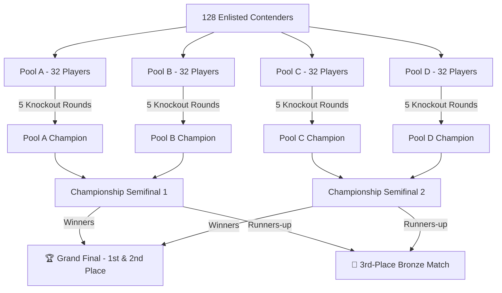

# ⚔️ CONSOLE CONQUEST — MORTAL KOMBAT 11 ESPORTS CHAMPIONSHIP

<div align="center">


**Official Flagship Esports Tournament Platform**  
*Organized by Department of Artificial Intelligence & Machine Learning (AIML)*  
**AISSMS College of Engineering, Pune** • *21st Engineering Today 2026*

[Live Demo](#-live-demo--preview) • [Tournament Structure](#-tournament-architecture-128-contenders) • [Key Features](#-key-features) • [Quick Start](#-quick-start) • [Admin Center](#-organizer-command-center) • [Security](#-production-grade-security--performance)

</div>

---

## 📖 Overview

**Console Conquest** is an esports-grade tournament management and registration web platform custom-built for the **Mortal Kombat 11 1v1 College Gaming Championship** during the *21st Engineering Today 2026* national festival.

Designed with a dark, cinematic Mortal Kombat aesthetic, the platform guarantees zero-collision atomic slot allocation, generates tamper-evident holographic QR passes, tracks live capacity across a 128-player knockout bracket, and gives tournament referees an organizer command center with live bracket winner advancement.

---

## 🏆 Tournament Architecture (128 Contenders)

The platform enforces a structured, fair, single-elimination tournament with **zero automatic byes**:



### Stage Breakdown
- **Pool Stage (Rounds 1–5)**: 4 symmetrical pools of 32 contenders (`Pool A`, `Pool B`, `Pool C`, `Pool D`). Best-of-3 rounds, 60-second timer.
- **Championship Semifinals**: 4 Pool Champions face off in Best-of-5 matchups.
- **Podium Decider**: Grand Final (Best-of-5) + Bronze Medal 3rd-place match to unambiguously determine 1st, 2nd, and 3rd place winners.

---

## ⚔️ Key Features

### 1. High-Performance Mortal Kombat 11 Experience
- **Cinematic Realm Intro**: Flaming particle physics engine, realm clash audio, and countdown animations.
- **Zero-Dependency Web Audio SFX**: Synthesized gong, slash, and victory reveal sounds without external audio assets.
- **0ms Input Latency**: Main-thread Gaussian blur overheads eliminated, hardware-accelerated tap response, and instant link prefetching.

### 2. Atomic Slot Allocation & Concurrency Guard
- **Race-Condition Safe**: Async mutex locking on the server guarantees sequential, conflict-free slot assignments (`#001` to `#128`) even during peak traffic spikes.
- **Triple Duplicate Shield**: Automatically blocks duplicate submissions across **Student Roll Number**, **Email Address**, and **Indian Mobile Number** (`[6-9]\d{9}`).
- **Dynamic Waitlist**: When the 128-seat cap is filled, newcomers are seamlessly placed on an indexed waitlist with automatic promotion capabilities.

### 3. Digital Holographic Pass & Verification
- **Dynamic Pass Generation**: Confirmed contenders receive a unique holographic credential pass featuring Pass ID (`CC-2026-XXXX`), slot assignment, and fighter portrait.
- **Scannable QR Ticket**: Referees scan the ticket at the reporting desk to verify attendance in real-time.
- **Public Door Scanner (`/verify/[id]`)**: Fast desk check-ins that display participant verification status while keeping contact info private.
- **Pass Search (`/lookup`)**: Players who misplaced their ticket can retrieve it instantly using their registration ID or registered email.

### 4. Interactive Live 128-Player Bracket (`/bracket`)
- Seamless pool switching (`Pool A`, `Pool B`, `Pool C`, `Pool D`, `Championship Finals`).
- Displays live scores, winner tags, fighter icons, and automatic advancement through the bracket hierarchy.

### 5. Organizer Command Center (`/admin`)
- Secure authentication protected by bcrypt password hashing and HttpOnly signed session cookies.
- Real-time metric cards: Total Slots, Claimed Slots, Available, Waitlist, and Desk Checked-In.
- Contender management: search, filter, check-in, slot reassignment, waitlist promotion, and disqualification.
- Live match scorer: update scores, declare match winners, and automatically seed winners into next-round matchups.
- 1-click **CSV Roster Export** for tournament desk coordinators.
- Emergency bracket & roster reset option with confirmation safeguard.

---

## 🛡️ Production-Grade Security & Performance

Built according to modern web development standards:
- **Strict Security Headers**: Enforced via `middleware.ts` (HSTS, CSP, X-Frame-Options `SAMEORIGIN`, X-Content-Type-Options `nosniff`, Referrer-Policy).
- **Anti-Bot & Anti-Spam Protection**: Invisible honeypot traps and submission timing validation (<1.5s rapid automated submissions rejected).
- **Rate Limiting**: Sliding-window IP rate limiting prevents brute-force registrations and DDoS attempts.
- **Clean Separation of Secrets**: Zero API secrets or database credentials exposed to client-side bundles.
- **Accessibility & Compliance**: WCAG AA color contrast, full keyboard navigation, cookie consent management (`CookieConsent.tsx`), and dedicated policy pages:
  - [`/privacy`](file:///d:/AIML%20Stuff/ET/app/privacy/page.tsx) — Participant Data Privacy Policy
  - [`/terms`](file:///d:/AIML%20Stuff/ET/app/terms/page.tsx) — Tournament Regulations, PS5 Controller Rules & Refund Terms
  - [`/rules`](file:///d:/AIML%20Stuff/ET/components/RulesSection.tsx) — Official 12-Point Tournament Rulebook

---

## 🛠️ Tech Stack

| Layer | Technologies |
|---|---|
| **Framework** | [Next.js 14](https://nextjs.org/) (App Router, Server Components & Route Handlers) |
| **Language** | [TypeScript 5](https://www.typescriptlang.org/) |
| **Styling** | [Tailwind CSS 3.4](https://tailwindcss.com/) + Custom MK11 Crimson Cyber Theme |
| **Database** | SQLite (Zero-config local development) / PostgreSQL (Production) |
| **ORM** | [Prisma ORM 5.21](https://www.prisma.io/) |
| **Icons & SFX** | Lucide React + Web Audio API |
| **QR Code Engine** | `qrcode` SVG/Canvas rendering |
| **Confetti FX** | `canvas-confetti` |

---

## 🚀 Quick Start

### 1. Prerequisites
- **Node.js**: v18.17.0 or higher (Node 20+ recommended)
- **npm** or **pnpm**

### 2. Clone the Repository
```bash
git clone https://github.com/YOUR_USERNAME/console-conquest-mk11.git
cd console-conquest-mk11
```

### 3. Install Dependencies
```bash
npm install
```

### 4. Environment Configuration
Create a `.env` file from `.env.example`:
```bash
cp .env.example .env
```

Default configuration for local development:
```env
DATABASE_URL="file:./prisma/dev.db"
AUTH_SECRET="your-32-character-random-secret-key-goes-here"
ADMIN_USERNAME="admin"
ADMIN_PASSWORD_HASH="$2a$10$wW9r3Fv2Pq9fP2k7M9N4sOZgR7nE9.iP4y8E9R1r6cZt0bFkUeG2a" # Default password: kombat2026!
NEXTAUTH_URL="http://localhost:3000"

NEXT_PUBLIC_EVENT_NAME="Console Conquest"
NEXT_PUBLIC_GAME_NAME="Mortal Kombat 11"
NEXT_PUBLIC_DEFAULT_MAX_SLOTS=128
NEXT_PUBLIC_EVENT_DATE="2026-09-29T09:00:00+05:30"
NEXT_PUBLIC_EVENT_VENUE="Room No. 340, AISSMS COE Campus, Pune"
```

### 5. Setup Database & Seed Initial Bracket
```bash
# Push schema to SQLite
npx prisma db push

# Seed tournament settings and initial matches
npm run db:seed
```

### 6. Run Development Server
```bash
npm run dev
```
Navigate to [http://localhost:3000](http://localhost:3000) in your browser.

---

## 🎮 Platform Routes & Navigation

| Route | Purpose | Access |
|---|---|---|
| `/` | Arena Homepage, countdown, prize pool, MK11 fighter preview, live slot bar | Public |
| `/register` | Contender enlistment form with validation and instant slot assignment | Public |
| `/confirmation/[id]` | Holographic official tournament pass with scannable QR ticket | Public / Contender |
| `/lookup` | Registration search and pass retrieval tool | Public |
| `/bracket` | Live 128-player interactive knockout bracket with pool navigation | Public |
| `/verify/[id]` | Door referee scanner for fast check-in validation | Public / Referees |
| `/rules` | Official 12 tournament rules & regulations | Public |
| `/terms` | Platform terms, conditions, controller policy, and refund rules | Public |
| `/privacy` | Data protection and privacy policy | Public |
| `/admin` | Organizer Command Center (roster, matches, winners, settings, CSV) | Restricted (`admin`) |

---

## 🛡️ Admin Command Center Credentials

- **URL**: `http://localhost:3000/admin`
- **Default Username**: `admin`
- **Default Password**: `kombat2026!`

*(Password can be hashed with bcrypt and changed in your `.env` or updated via the Admin panel).*

---

## 🧪 Concurrency & Load Testing

To verify atomic slot allocation under concurrent load:
```bash
npx tsx scripts/test-concurrency.ts
```
This script spawns simultaneous registration attempts using `Promise.all` and verifies:
1. Every applicant receives an atomic, strictly unique slot number.
2. Duplicate roll numbers, emails, and phone numbers are rejected with 0 collisions.

---

## 📁 Project Structure

```
console-conquest-mk11/
├── app/
│   ├── api/                     # REST API routes
│   │   ├── admin/               # Auth, participants, match winners, CSV export
│   │   ├── bracket/             # Public bracket match state
│   │   ├── lookup/              # Pass retrieval by email/regId
│   │   ├── register/            # Atomic registration & slot allocation
│   │   └── tournament/status/   # Real-time slot count & event settings
│   ├── confirmation/[id]/       # Holographic pass page
│   ├── verify/[id]/             # Referee QR door scanner page
│   ├── lookup/                  # Pass search tool
│   ├── privacy/                 # Privacy Policy
│   ├── terms/                   # Terms & Conditions
│   ├── layout.tsx               # Global layout, metadata & providers
│   ├── page.tsx                 # Main Arena Landing Page
│   ├── not-found.tsx            # Custom Mortal Kombat 404 defeat page
│   ├── icon.svg                 # Tournament crest favicon
│   ├── opengraph-image.tsx      # Dynamic 1200x630 social preview image
│   ├── sitemap.ts               # Dynamic XML sitemap
│   └── robots.ts                # Search engine crawler configuration
├── components/
│   ├── AdminDashboard.tsx       # Complete organizer command center
│   ├── ArenaParticles.tsx       # Lightweight canvas ember background
│   ├── CookieConsent.tsx        # GDPR/Privacy cookie preferences banner
│   ├── HeroSection.tsx          # Dynamic tournament hero & CTA
│   ├── MortalKombatIntro.tsx    # Cinematic realm intro modal
│   ├── Navbar.tsx               # Responsive header navigation
│   ├── RegistrationForm.tsx     # Contender form with anti-bot validation
│   ├── RosterPreview.tsx        # MK11 playable fighter showcase
│   ├── RulesSection.tsx         # Official rulebook & pool table
│   ├── SlotCounter.tsx          # Real-time 128-slot indicator
│   ├── StickyMobileCTA.tsx      # High-conversion sticky mobile button
│   └── TournamentBracket.tsx    # 128-player knockout bracket viewer
├── lib/
│   ├── analytics.ts             # Privacy-respecting telemetry tracker
│   ├── config.ts                # Tournament constants, pools, and rules
│   ├── db.ts                    # Prisma database client singleton
│   ├── sound.ts                 # Zero-dependency synthesized Web Audio SFX
│   ├── types.ts                 # TypeScript type definitions
│   └── validation.ts            # Input validation & bot honeypot checks
├── prisma/
│   ├── schema.prisma            # Database models (Participant, Match, Setting, Admin)
│   └── dev.db                   # Local development SQLite store
├── public/                      # Static assets & audio
├── scripts/
│   ├── seed.ts                  # Bracket and initial tournament seeder
│   └── test-concurrency.ts      # Concurrency stress tester
├── middleware.ts                # HTTPS redirection & security headers
├── next.config.mjs              # Image optimization, compression & caching
└── tailwind.config.ts           # Custom MK11 theme tokens & keyframes
```

---

## 🏛️ Acknowledgements & Credits

- **AISSMS College of Engineering, Pune** — Host institution for *Engineering Today 2026*.
- **Department of Artificial Intelligence & Machine Learning (AIML)** — Event organizers and coordinators.
- **Mortal Kombat 11** — NetherRealm Studios & Warner Bros. Interactive Entertainment (Fan-tribute tournament design).

---

<div align="center">

**Console Conquest 2026 • May the Mightiest Fighter Prevail**

</div>
